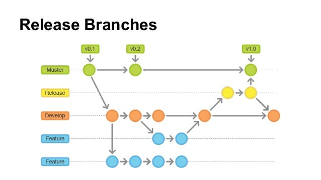

# Capítulo V: Product Implementation, Validation & Deployment
## 5.1 Software Configuration Management
A continuación, presentaremos el proceso por el cual organizamos, gestionamos y controlamos los cambios en el desarrollo de este proyecto.
### 5.1.1. Software Development Environment Configuration.
**Requirements Management**
1. Trello: Es una herramienta utilizada para gestionar el flujo de trabajo de proyectos principalmente basados en marcos de
   trabajos ágiles. Será empleado para visualizar y actualizar el estado actual de las tareas e historias de usuario
   pertenecientes al sprint a desarrollar. Ruta de referencia https://trello.com/es
  

**Product UX/UI Design**

1. Figma: Plataforma de elaboración de prototipos y edición gráfica, principalmente utilizado para el diseño digital. En el
   caso del proyecto, será utilizado para el prototipado de la aplicación y sus versiones de Desktop y Mobile Web Browser.
   Ruta de referencia https://www.figma.com/login
2. Lucidchart: Aplicación para diagramar flujos. Será empleado para el diseño de wireflows, user-flows y el diagrama de
   clases asociado a la aplicación. Ruta de referencia https://www.lucidchart.com/
     
 **Software Testing**
1. Gherkin: Es un sistema de etiquetado utilizado para describir los criterios de aceptación de estructura de una user story.
   Ruta de referencia https://cucumber.io/docs/gherkin/  

**Software Development**
1. Visual Studio Code: Entorno de desarrollo integrado elegido para la elaboración y compilación del código por motivos de
   dominio por parte de los integrantes del equipo de trabajo. Utilizar este IDE supone de valor para el desarrollo del
   proyecto puesto que incluye la posibilidad de agregar extensiones de utilidad, soporte de edición de texto en múltiples
   lenguajes de programación, disponibilidade en múltiples sistemas operativos, entre otros beneficios. Ruta de referencia
   https://code.visualstudio.com/  
   <br>
2. HTML5: HyperText Markup Language, o por sus siglas HTML, es un lenguaje de etiquetado para páginas web. Será
   empleado en el desarrollo del proyecto para la presentación del contenido en la aplicación. Ruta de referencia
   https://www.w3schools.com/html/html5_syntax.asp   
   <br>
3. CSS: Cascading Style Sheets es un lenguaje que maneja el diseño y presentación de las páginas web, el cual va de la mano
   con HTML. Ruta de referencia https://google.github.io/styleguide/htmlcssguide.html
   <br>
   <br>
 4. Tailwind CSS: Es un conjunto de herramientas de utilidad de CSS altamente personalizable y orientado a clases. Se utilizará para diseñar y estilizar la interfaz de usuario dentro de la aplicación. Puedes encontrar información detallada en la documentación
oficial de Tailwind CSS: https://tailwindcss.com/docs
   <br>

**Software Deployment**
1. Git: Herramienta de control de versiones que permite registrar y gestionar las diferentes versiones del programa. Se
   utilizará para mantener un historial de cambios y simplificar la corrección de errores. Los miembros del equipo accederán
   a través de la línea de comandos en sus sistemas locales. Ruta de referencia https://git-scm.com/
   <br>
   <br>
**Software Documentation and Project Management**
2. Github: Plataforma basada en la nube que alojará los repositorios de código del proyecto. Facilitará la colaboración en
   tiempo real y la revisión de contribuciones de cada miembro del equipo. Los miembros del equipo accederán a través de
   sus navegadores web. Ruta de referencia https://github.com/


### 5.1.2. Source Code Management.
El proyecto seguirá las convenciones del flujo de trabajo establecido por el modelo GitFlow para el control de versiones, empleando GitHub como plataforma y sistema de control de versiones. A continuación, se describirá la implementación de GitFlow como un flujo de trabajo para el control de versiones, junto con el enlace del Landing Page.
  
**Repositorio de GitHub:** 
- Enlace para acceder a la [organización en GitHub](https://github.com/Open-Source-WX55-Group-UFriends)   
- Enlace para acceder al repositorio de la [landing Page](https://github.com/Open-Source-WX55-Group-UFriends/landing-page)
- Enlace para acceder al repositorio del [reporte final](https://github.com/Open-Source-WX55-Group-UFriends/Report-Final-Project)

**Flujo de trabajo GitFlow**

El flujo de trabajo a ser implementado para el desarrollo del proyecto se basará en el modelo propuesto por Vincent Driessen en "A successful Git branching model".
   
 

**Estructura de branches (Ramas):**
 1. **Master branch (Rama principal):** Esta rama servirá como la principal para la aplicación, alojando versiones estables y finales del desarrollo. Únicamente se aceptarán cambios que hayan sido previamente probados y verificados en los features y de ahí en Developer.
 2. **Develop branch (Rama de desarrollo):** El propósito de esta rama es facilitar los avances del proyecto en equipo y mantener los archivos centrales del desarrollo continuo.
 3. **Feature branch(Ramas de funcionalidad):** Cada capitulo desarrollado por el equipo, o separada del enfoque actual del desarrollo, tendrá su propia rama. Una vez que una funcionalidad esté completamente trabajada, se fusionará con la rama de desarrollo del proyecto. Las convenciones para nombrar las ramas de funcionalidad seguirán un patrón descriptivo y único, por ejemplo, "feature/chapter-#".
### 5.1.3. Source Code Style Guide & Conventions.
 **HTML:** Algunas de las prácticas que deben de seguirse para alcanzar un código coherente, sostenible y ordenado son las
siguientes:
1. Cerrar todos los elementos HTML: Por ejemplo, ```<p>Esto es un párrafo.</p>```
2. A pesar de que HTML permite combinar mayúsculas y minúsculas en los nombrs de los elementos y atributos, se limitará
   al uso de minúsculas para mantener el orden y garantizar la legibilidad.
3. Utilizar comillas en caso de que los atributos contengan espacios entre sí.
4.  Procurar especificar el texto alt y las dimensiones width y height de las imágenes, ya que de esta manera se facilitará la
    disponibilidad del contenido. Por ejemplo:   ``````  
 <br>
**Gherkin:** Es un lenguaje de dominio específico, el cual busca solucionar un problema concreto, la comunicación entre los
    negocios y la parte técnica al trabajar con Behavior Driven Development, abreviado por sus siglas en ingles como BBD. En busca
    de una buena práctica, se ocuparon los saltos de línea para mejorar el orden de los diversos tipos de escenarios y diferenciarlos
    de forma más óptima. Adicionalmente, se utilizaron las palabras clave "Given", "When", "Then" y "And" para estructurar los
    escenarios.

### 5.1.4. Software Deployment Configuration.
## Landing page deployment:
Para desplegar la landing page es necesario contar con una serie de requisitos, entre ellos, es necesario contar con
una cuenta personal, una organización y un repositorio al cual cargar los documentos. A partir de lo anterior, es posible
comenzar el despliegue de la landing page. A continuación se enuncian los pasos a seguir:

1. Crear una carpeta llamada "docs" para alojar el Landing Page.
2. Asegurarse de que los archivos sigan las nomenclaturas "index.html", para la landing page; "input.css" y "output.css" para poder utilizar Tailwind y
   una carpeta llamada "img" que contenga las imágenes.

---MATHIAS

3. Cargar los archivos al repositorio mediante un commit.
4. Dirigirse a Settings > Pages y seleccionar el branch correspondiente, en nuestro caso es el "main".
5. Especificar la carpeta "docs" como la fuente de la página.
6. Esperar a que GitHub realice las comprobaciones necesarias. Una vez culminado el proceso, se obtendrá un enlace que
   llevará al Landing Page desplegado

--MATHIAS
--PARTE DE MATHI
### 5.2. Landing Page, Services & Applications Implementation.

### 5.2.1 Sprint 1.
#### 5.2.1.1 Sprint Planing 1.


En el marco de Scrum, un Sprint es un período de tiempo definido y breve en el que un equipo de desarrollo trabaja en 
las tareas necesarias para lograr un objetivo específico del producto, conocido como "Product Goal". En el proyecto de 
desarrollo de FarmLogiTech, se han planificado cuatro sprints, cada uno con una duración de dos semanas.

El Sprint #1, que comienza el 06/04/2024, tiene como objetivo principal crear una landing page atractiva 
para FarmLogiTech. Esta página debe ser diseñada para captar la atención de los usuarios visitantes y comunicar 
de manera clara y efectiva los principales beneficios ofrecidos por el producto. En resumen, durante este sprint 
se enfocarán en el diseño y desarrollo de la landing page para cumplir con los objetivos establecidos.

| Sprint | Prepared Date | Time      | Location                              | Prepared By     | Attendees                                                                      | Sprint 1 Goal | Sprint 1 Velocity | Sum of Story Points |
|--------|---------------|-----------|---------------------------------------|-----------------|--------------------------------------------------------------------------------|---------------|-------------------|---------------------|
|   1    | 06/04/2024    | 09:00  AM | Reunión virtual mediante Google meet  | Rodrigo Aguilar | Rodrigo Aguilar, Mathias Kunimoto, Janiel Escalante, Augusto Pin, Luciano Ruiz | Elaborar y diseñar una landing page atractiva e informativa para la aplicación Greenhouse | PRODUCT BACKLOG   | PRODUCT BACKLOG  |

#### 5.2.1.2. Sprint Backlog 1.
En el primer sprint, el equipo tuvo como objetivo principal crear una landing page atractiva y funcional. Utilizamos la herramienta Trello para organizar y asignar tareas a los miembros del equipo según sus habilidades.

link del trello: https://trello.com/b/WJXt50JP/farmlogitech

| Sprint #   | Sprint 1 |      |
|------------|---------|------|
| User Story |         | 09:00  AM | Reunión virtual mediante Google meet  | Elaborar y diseñar una landing page atractiva e informativa para la aplicación Greenhouse | PRODUCT BACKLOG   | PRODUCT BACKLOG  |
| --------   |


#### 5.2.1.3. Development Evidence for Sprint Review.
| Repository  | Branch | Commit id | Commit Message|Commit Message Body | Commited on (Date)|
|-------------|--------|-----------|------------------------------------|--------------------|-------- 
| User Story  |        | 09:00  AM | Reunión virtual mediante Google meet | Elaborar y diseñar una landing page atractiva e informativa para la aplicación Greenhouse | PRODUCT BACKLOG   | PRODUCT BACKLOG  |
| --------    |

#### 5.2.1.5. Execution Evidence for Sprint Review.


5.2.
Landing Page, Services & Applications Implementation.
5.2.1. Sprint 1
5.2.1.1.
5.2.1.2.
5.2.1.3.
5.2.1.4.
5.2.1.5.
5.2.1.6.
5.2.1.7.
5.2.1.8.
Sprint Planning 1.
Sprint Backlog 1.
Development Evidence for Sprint Review.
Testing Suite Evidence for Sprint Review.
Execution Evidence for Sprint Review.
Services Documentation Evidence for Sprint Review.
Software Deployment Evidence for Sprint Review.
Team Collaboration Insights during Sprint. 